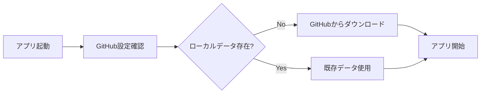

# 📁 プロジェクト構造

## 📋 ディレクトリ構成

```
wiki-chatbot-main/
├── README.md                      # プロジェクト概要
├── .gitignore                     # Git除外設定
├── .streamlit/                    # Streamlit設定
│   └── secrets.toml.example       # 設定例ファイル
├── docs/                          # ドキュメント
│   ├── IMPLEMENTATION_GUIDE.md    # 実装ガイド
│   ├── TROUBLESHOOTING.md         # トラブルシューティング
│   └── PROJECT_STRUCTURE.md       # このファイル
└── wiki_chatbot/                  # メインアプリケーション
    ├── app.py                     # Streamlitエントリーポイント
    ├── requirements.txt           # Python依存関係
    ├── requirements-dev.txt       # 開発用依存関係
    ├── requirements-full.txt      # 全機能用依存関係
    ├── requirements-minimal.txt   # 最小構成依存関係
    ├── pyproject.toml            # Python プロジェクト設定
    ├── docker-compose.yml        # Docker設定
    ├── Dockerfile                # Docker設定
    ├── config/                   # 設定管理
    │   ├── __init__.py
    │   ├── web_settings.py       # Web設定
    │   ├── database.py           # データベース設定
    │   ├── github_settings.py    # GitHub同期設定（新規）
    │   └── prompts/              # プロンプト設定
    │       └── products/         # 商材別プロンプト
    ├── utils/                    # ユーティリティ
    │   ├── __init__.py
    │   ├── chatbot.py            # チャットボット機能
    │   ├── rag_manager.py        # RAG管理
    │   ├── session_manager.py    # セッション管理
    │   ├── github_sync.py        # GitHub同期機能（新規）
    │   ├── feedback_manager.py   # フィードバック管理
    │   ├── file_handler.py       # ファイル処理
    │   ├── prompt_manager.py     # プロンプト管理
    │   └── llm_manager.py        # LLM管理
    ├── pages/                    # Streamlitページ
    │   ├── __init__.py
    │   ├── admin.py              # 管理画面
    │   ├── settings.py           # 設定画面
    │   └── prompt_settings.py    # プロンプト設定
    ├── data/                     # データ保存（Git LFS管理）
    │   ├── chroma_db/            # RAGベクトルデータベース
    │   │   └── chroma.sqlite3    # ChromaDBファイル
    │   ├── chatbot.db            # チャット履歴SQLite
    │   ├── chat_history.csv      # チャット履歴エクスポート
    │   └── user_feedback.csv     # ユーザーフィードバック
    └── docs/                     # アプリ内ドキュメント
        ├── code_architecture_guide.md
        └── web_deployment_guide.md
```

## 🔧 主要ファイルの説明

### 🚀 アプリケーションコア

| ファイル | 説明 | 重要度 |
|---------|------|--------|
| `app.py` | Streamlitエントリーポイント、GitHub同期初期化を含む | ⭐⭐⭐⭐⭐ |
| `requirements.txt` | 本番用Python依存関係（GitPython追加済み） | ⭐⭐⭐⭐⭐ |

### ⚙️ 設定管理

| ファイル | 説明 | 重要度 |
|---------|------|--------|
| `config/web_settings.py` | Webアプリケーション設定 | ⭐⭐⭐⭐ |
| `config/database.py` | データベース接続設定 | ⭐⭐⭐⭐ |
| `config/github_settings.py` | **GitHub同期設定（新規追加）** | ⭐⭐⭐⭐⭐ |

### 🛠️ ユーティリティ

| ファイル | 説明 | 重要度 |
|---------|------|--------|
| `utils/github_sync.py` | **GitHub同期機能（新規追加）** | ⭐⭐⭐⭐⭐ |
| `utils/chatbot.py` | チャットボット機能 | ⭐⭐⭐⭐ |
| `utils/rag_manager.py` | RAG管理機能 | ⭐⭐⭐⭐ |
| `utils/session_manager.py` | セッション管理 | ⭐⭐⭐⭐ |

### 📊 データ

| ディレクトリ/ファイル | 説明 | Git LFS管理 |
|---------------------|------|-------------|
| `data/chroma_db/` | ChromaDBベクトルデータベース | ✅ |
| `data/chatbot.db` | SQLiteチャット履歴 | ✅ |
| `data/*.csv` | エクスポートデータ | ✅ |

### 📚 ドキュメント

| ファイル | 説明 | 対象読者 |
|---------|------|---------|
| `README.md` | プロジェクト概要・クイックスタート | 全員 |
| `docs/IMPLEMENTATION_GUIDE.md` | GitHub永続化実装詳細ガイド | 開発者 |
| `docs/TROUBLESHOOTING.md` | トラブルシューティング | 運用者 |
| `docs/PROJECT_STRUCTURE.md` | プロジェクト構造説明 | 開発者 |

## 🔄 データフロー

### 起動時データ同期



### データ保存フロー


## 🚀 GitHub永続化関連の新規追加ファイル

### 必須ファイル

1. **`config/github_settings.py`**
   - GitHub同期設定管理
   - Streamlit Secretsからの設定読み込み
   - 設定値検証

2. **`utils/github_sync.py`**
   - GitHub同期のコア機能
   - Git LFS操作
   - データアップロード・ダウンロード

### 設定ファイル

3. **`.streamlit/secrets.toml.example`**
   - 環境変数設定例
   - 本番環境用設定テンプレート

4. **`.gitignore`**
   - 不要ファイル除外設定
   - データファイル除外（別リポジトリ管理のため）

## 📦 依存関係

### 新規追加パッケージ

```txt
# GitHub Integration
GitPython>=3.1.40
```

### 既存パッケージ（重要なもの）

```txt
# Core
streamlit>=1.28.0
openai>=1.3.0

# RAG
langchain>=0.0.335
chromadb>=0.4.15
pysqlite3-binary>=0.5.4

# Document Processing
pypdf>=3.17.0
python-docx>=0.8.11
pandas>=2.1.3
```

## 🔐 セキュリティ考慮事項

### 機密情報管理

- ✅ GitHub Personal Access Token は Streamlit Secrets で管理
- ✅ データリポジトリは Private に設定
- ✅ `.streamlit/secrets.toml` は `.gitignore` で除外
- ✅ ログにトークン情報を出力しない

### データ保護

- ✅ データは暗号化されたGit LFS で保存
- ✅ アクセス権限は最小限に制限
- ✅ 認証機能でアクセス制御

## 🧪 テスト構造

### テスト対象

1. **GitHub同期機能**
   - 接続テスト
   - アップロード・ダウンロードテスト
   - エラーハンドリングテスト

2. **データ整合性**
   - バックアップ・復元の完全性
   - データベース整合性チェック

3. **セキュリティ**
   - 認証テスト
   - アクセス権限テスト

## 📈 パフォーマンス考慮事項

### ファイルサイズ管理

- **ChromaDB**: 商材あたり 10-100MB
- **SQLite**: チャット履歴1万件で約10MB
- **合計**: 通常 100-500MB程度

### Git LFS制限

- **GitHub無料枠**: 1GB/月
- **監視が必要**: 月次使用量チェック

## 🔄 今後の拡張計画

### Phase 2: 自動化強化

- GitHub Actions による定期バックアップ
- Webhook による リアルタイム同期
- 障害監視・通知機能

### Phase 3: マルチ環境対応

- 開発・ステージング・本番環境分離
- 環境別データ管理
- CI/CD パイプライン構築

---

**このプロジェクト構造により、Streamlit Cloudでの永続的なデータ保存が実現されます。** 🎉