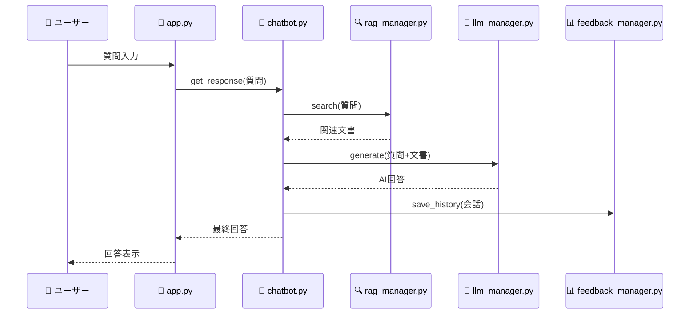
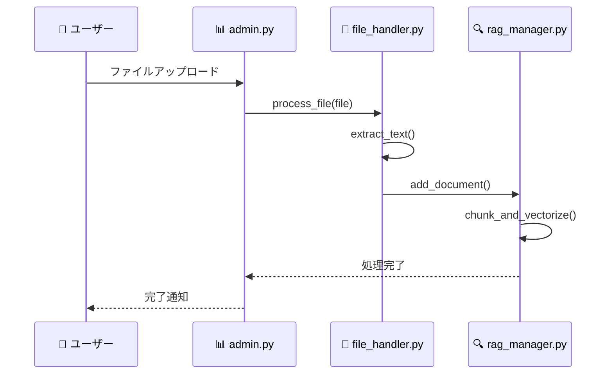

# 🏗️ Wiki Chatbot コードアーキテクチャガイド

**🎯 対象読者**: プログラミング初心者・新人エンジニア・初めてこのプロジェクトに参加する方
**📖 目的**: システム全体の構造と各モジュールの役割を分かりやすく理解する
**⏱️ 読了時間**: 約30分

> 💡 **このガイドについて**
> このドキュメントは、プログラミング経験が浅い方でも理解できるよう、専門用語の解説を含めて書かれています。コードを読む前に、まずはこのガイドでシステム全体を理解しましょう！

---

## 📚 目次

1. [システム全体像](#1-システム全体像)
2. [ディレクトリ構造と役割](#2-ディレクトリ構造と役割)
3. [主要モジュール詳細](#3-主要モジュール詳細)
4. [データの流れ](#4-データの流れ)
5. [機能別モジュール関係図](#5-機能別モジュール関係図)
6. [開発時の重要ポイント](#6-開発時の重要ポイント)
7. [トラブルシューティング](#7-トラブルシューティング)

---

## 1. システム全体像

### 🤖 Wikiチャットボットとは？

このシステムは、企業の社内文書（PDF、Word文書など）をアップロードすると、その内容について質問に答えてくれるAIチャットボットです。

### 🔄 基本的な動作フロー

```mermaid
graph LR
    A[ユーザーの質問] → B[文書検索]
    B → C[関連情報抽出]
    C → D[AI回答生成]
    D → E[回答表示]
```

1. **ユーザーが質問入力** → 「この商品の価格は？」
2. **システムが文書検索** → アップロードされたPDFから関連部分を検索
3. **AIが回答生成** → 検索結果をもとに自然な回答を作成
4. **回答をユーザーに表示** → 「この商品の価格は月額10,000円です」

### 🏢 技術スタック（使用技術）

- **フロントエンド**: Streamlit（Webアプリ作成ツール）
- **AI/LLM**: OpenAI GPT / Anthropic Claude / Google Gemini
- **文書検索**: ChromaDB（ベクトルデータベース）
- **ファイル処理**: PyPDF2, python-docx（文書読み込み）
- **データ保存**: SQLite（軽量データベース）

---

## 2. ディレクトリ構造と役割

### 📁 プロジェクト全体構造

```
wiki_chatbot/                    # 📁 プロジェクトルート
│
├── 🚀 app.py                   # ✨ メインアプリケーション（最初に起動するファイル）
│
├── 📄 pages/                   # 🖥️ Streamlitページファイル群
│   ├── admin.py               # 📊 管理画面（ファイル管理・分析）
│   ├── settings.py            # ⚙️ 設定画面（LLM・RAG設定）
│   └── prompt_settings.py     # 💬 プロンプト設定画面
│
├── ⚙️ config/                  # 🔧 設定ファイル群
│   ├── settings.py            # 📋 統合設定管理（全システム設定）
│   ├── database.py            # 🗄️ データベース設定
│   ├── web_settings.py        # 🌐 Web設定
│   └── persistent_storage.py  # 💾 永続化ストレージ管理
│
├── 🛠️ utils/                   # 🔨 ユーティリティ機能群
│   ├── chatbot.py             # 🤖 チャットボット中核処理
│   ├── llm_manager.py         # 🧠 LLM管理（AI API統合）
│   ├── rag_manager.py         # 🔍 RAG検索システム
│   ├── enhanced_rag_manager.py # 🔍+ 拡張RAG機能
│   ├── file_handler.py        # 📁 ファイル処理
│   ├── feedback_manager.py    # 📊 フィードバック・履歴管理
│   ├── prompt_manager.py      # 💬 プロンプト管理
│   └── session_manager.py     # 👤 セッション管理
│
├── 🗂️ data/                    # 💿 データ保存領域
│   ├── products/              # 📄 商材別アップロードファイル
│   ├── chroma_db/             # 🔍 ベクトルデータベース
│   ├── chatbot.db             # 📝 チャット履歴データベース
│   └── feedback.csv           # 📊 フィードバックCSV
│
├── 📚 docs/                    # 📖 ドキュメント群
│   ├── code_architecture_guide.md  # このファイル
│   └── web_deployment_guide.md     # デプロイメントガイド
│
└── 📦 依存関係ファイル
    ├── requirements.txt       # Python依存パッケージ
    ├── .streamlit/           # Streamlit設定
    └── .env                  # 環境変数（秘密情報）
```

### 🎯 各ディレクトリの役割

| ディレクトリ | 役割 | 初心者向け説明 |
|------------|------|----------------|
| **app.py** | 🚀 エントリーポイント | プログラムが最初に実行されるファイル。家に例えると「玄関」 |
| **pages/** | 🖥️ 画面定義 | ユーザーが見る画面の作り方を書いた設計図 |
| **config/** | ⚙️ 設定管理 | システムの動作を決める「設定ファイル」の保管場所 |
| **utils/** | 🛠️ 機能実装 | 実際の処理を行う「道具箱」。各機能が独立したファイルに分かれている |
| **data/** | 💿 データ保存 | アップロードしたファイルやチャット履歴を保存する「倉庫」 |

---

## 3. 主要モジュール詳細

### 🚀 **app.py** - システムの玄関口

```python
# app.pyの役割を家に例えると「玄関」
def main():
    # 1. お客様をお迎え（セッション初期化）
    # 2. どの部屋に行くか案内（ページルーティング）
    # 3. 必要な準備をする（設定読み込み）
```

**📋 主な責任**:
- アプリケーションの起動と初期化
- ページナビゲーション（どの画面を表示するか決める）
- セッション管理の開始
- エラーハンドリング

**🔗 他モジュールとの関係**:
- `utils/session_manager.py` → セッション初期化を依頼
- `pages/` → 各画面の表示を委託
- `config/settings.py` → システム設定を取得

---

### 🤖 **utils/chatbot.py** - チャットボットの頭脳

```python
# チャットボットの思考プロセス
class WikiChatbot:
    def get_response(self, user_message):
        # 1. 「あ、質問が来た！」
        # 2. 「関連する資料を探そう」(RAG検索)
        # 3. 「AIに聞いて答えを作ろう」(LLM呼び出し)
        # 4. 「答えをお客様に返そう」
```

**🎯 このモジュールがやること**:
- ユーザーの質問を受け取る
- 関連文書を検索する
- AIに回答生成を依頼する
- 最終的な回答をユーザーに返す

**🧩 関連モジュール**:
- `rag_manager.py` → 「関連文書を探して！」
- `llm_manager.py` → 「AIさん、答えを作って！」
- `prompt_manager.py` → 「どんな風に質問すればいい？」
- `feedback_manager.py` → 「この会話を記録しておいて」

---

### 🧠 **utils/llm_manager.py** - AI API の統合管理者

```python
# AI秘書との会話を管理
class LLMManager:
    def generate_response(self, messages):
        # 1. どのAI（OpenAI/Claude/Gemini）を使う？
        # 2. APIキーは設定されてる？
        # 3. 質問を適切な形式に変換
        # 4. AI APIに送信して回答を取得
        # 5. エラーが起きたら他のAIを試す
```

**💡 初心者向け解説**:
LLM（Large Language Model）= 大規模言語モデル = ChatGPTのようなAI

**🎯 このモジュールがやること**:
- 複数のAIサービス（OpenAI、Claude、Gemini）を統合管理
- APIキーの管理と認証
- エラー時の自動フェイルオーバー（別のAIに切り替え）
- 使用量とコストの追跡

**🔧 技術的なポイント**:
- **優先順位制御**: OpenAI → Anthropic → Google の順で試行
- **コスト管理**: トークン使用量の計算と表示
- **エラー処理**: 1つのAIがダメでも他を自動で試す

---

### 🔍 **utils/rag_manager.py** - 賢い図書館司書

```python
# 図書館司書のお仕事
class RAGManager:
    def search(self, query):
        # 1. 「〇〇について調べて」という依頼を受ける
        # 2. 本棚（ベクトルDB）から関連する本を探す
        # 3. 見つけた本の関連ページを返す
        # 4. 「この本のこのページが参考になりますよ」
```

**💡 RAGって何？**
- **R**etrieval = 検索（情報を探すこと）
- **A**ugmented = 強化された
- **G**eneration = 生成

つまり「検索で見つけた情報を使って、より良い回答を生成する技術」です。

**🎯 このモジュールがやること**:
- アップロードされた文書をベクトル化（数値に変換）
- 質問に関連する文書部分を高速検索
- 検索結果の関連性評価とランキング
- 複数ファイル形式（PDF、Word、CSV等）に対応

**🔧 重要な概念**:
- **チャンク**: 長い文書を小さな塊に分割したもの
- **ベクトル**: 文章の意味を数値で表現したもの
- **類似度**: ベクトル同士がどれだけ似ているかの指標

---

### 📁 **utils/file_handler.py** - ファイルの翻訳家

```python
# いろんな形式のファイルを読む専門家
class FileHandler:
    def extract_text(self, file):
        if file.type == "pdf":
            # PDFから文字を取り出す魔法
        elif file.type == "docx":
            # Wordから文字を取り出す魔法
        elif file.type == "csv":
            # CSVを質問-回答形式に変換する魔法
```

**🎯 このモジュールがやること**:
- 様々なファイル形式からテキストを抽出
- CSVファイルをQ&A形式に変換
- ファイルのアップロード・削除管理
- テンプレートファイルの提供

**📋 対応ファイル形式**:
- **PDF**: 📄 学習資料、マニュアル、報告書
- **Word**: 📝 企画書、仕様書、議事録
- **PowerPoint**: 📊 プレゼン資料
- **CSV**: 📊 FAQ、価格表、製品一覧
- **HTML**: 🌐 Webページ、ヘルプページ
- **TXT**: 📃 テキストファイル

---

### 📊 **utils/feedback_manager.py** - 記録係＆分析者

```python
# 会話の記録と分析の専門家
class FeedbackManager:
    def save_chat_history(self, conversation):
        # 1. 会話をCSVファイルに保存（バックアップ）
        # 2. データベースにも保存（高速検索用）
        # 3. 満足度や評価も一緒に記録
```

**🎯 このモジュールがやること**:
- チャット履歴の永続化保存
- ユーザーフィードバックの収集・分析
- データのCSV出力機能
- 満足度統計の生成

**💾 データ保存戦略**:
- **CSV**: 人間が読みやすい形式、バックアップとして保存
- **SQLite**: 高速検索可能、システムの主要データベース

---

### 💬 **utils/prompt_manager.py** - AIとの通訳者

```python
# AIとの会話方法を管理する通訳者
class PromptManager:
    def get_system_prompt(self, style, product):
        # 「この商品について、こんな風に答えてください」
        # という指示書をAIに渡す
```

**💡 プロンプトって何？**
AIに送る「指示書」のこと。「丁寧に答えて」「専門用語は避けて」などの指示をプロンプトで指定します。

**🎯 このモジュールがやること**:
- 用途別のプロンプトテンプレート管理
- 製品固有のプロンプトカスタマイズ
- プロンプトの階層管理（汎用 → 製品固有 → カスタム）
- 動的な変数展開（商品名、会社名の自動置換）

---

### 👤 **utils/session_manager.py** - 受付係＆警備員

```python
# Webアプリの受付係
class SessionManager:
    def initialize_session(self):
        # 「いらっしゃいませ！初回ですか？」
        # 来訪者の情報を記録開始

    def check_authentication(self):
        # 「パスワードを確認させていただきます」
```

**🎯 このモジュールがやること**:
- ユーザーセッションの初期化と管理
- 認証（パスワード）機能
- 使用量制限（1セッションあたりの質問数）
- セッション有効期限の管理

---

## 4. データの流れ

### 📊 チャット処理のデータフロー



### 📁 ファイルアップロード処理のフロー



---

## 5. 機能別モジュール関係図

### 🤖 チャット機能の関係図

```
        👤 ユーザー質問
             ⬇️
        🚀 app.py (受付)
             ⬇️
        🤖 chatbot.py (司令塔)
        ┌─────────┼─────────┐
        ⬇️         ⬇️         ⬇️
   🔍 rag_manager  🧠 llm_manager  💬 prompt_manager
   (文書検索)      (AI呼び出し)    (指示作成)
        ⬇️         ⬇️         ⬇️
        └─────────┼─────────┘
             ⬇️
        📊 feedback_manager
        (履歴保存)
             ⬇️
        👤 ユーザーに回答
```

### 📁 ファイル管理機能の関係図

```
        👤 管理者
             ⬇️
        📊 admin.py (管理画面)
             ⬇️
        📁 file_handler.py (ファイル処理)
        ┌─────────┼─────────┐
        ⬇️         ⬇️         ⬇️
   PDF処理      Word処理     CSV処理
        ⬇️         ⬇️         ⬇️
        └─────────┼─────────┘
             ⬇️
        🔍 rag_manager.py
        (ベクトル化・検索準備)
             ⬇️
        💾 data/ (データ保存)
```

### ⚙️ 設定管理機能の関係図

```
        👤 管理者
             ⬇️
        ⚙️ settings.py (設定画面)
             ⬇️
        📋 config/settings.py (設定中枢)
        ┌─────────┼─────────┐
        ⬇️         ⬇️         ⬇️
   LLM設定      RAG設定     システム設定
        ⬇️         ⬇️         ⬇️
   🧠 llm_manager  🔍 rag_manager  🚀 app.py
        ⬇️         ⬇️         ⬇️
        └─────────┼─────────┘
             ⬇️
        全システムに設定反映
```

---

## 6. 開発時の重要ポイント

### 🚨 初心者が陥りがちな問題と解決法

#### 1. **Streamlitのセッション状態管理**

```python
# ❌ 間違った方法（エラーになる）
user_name = st.session_state.user_name  # KeyErrorが発生する可能性

# ✅ 正しい方法
if "user_name" not in st.session_state:
    st.session_state.user_name = "デフォルト値"

# または
user_name = st.session_state.get("user_name", "デフォルト値")
```

**なぜこうするの？**
Streamlitは画面が更新されるたびにPythonスクリプトが最初から実行されます。セッション状態を使うことで、データを画面更新をまたいで保持できます。

#### 2. **エラーハンドリングの重要性**

```python
# ❌ 間違った方法（エラーでアプリが停止）
def call_openai_api(prompt):
    response = openai.chat.completions.create(...)
    return response.choices[0].message.content

# ✅ 正しい方法（エラーでも動き続ける）
def call_openai_api(prompt):
    try:
        response = openai.chat.completions.create(...)
        return response.choices[0].message.content
    except openai.APIError as e:
        st.error(f"OpenAI APIエラー: {e}")
        return "申し訳ございません。現在AIサービスに接続できません。"
    except Exception as e:
        st.error(f"予期しないエラー: {e}")
        return "申し訳ございません。エラーが発生しました。"
```

**なぜ重要？**
外部API（OpenAI等）は時々エラーになります。エラー処理をしないと、アプリ全体が停止してしまいます。

#### 3. **ファイルパスの扱い**

```python
# ❌ 間違った方法（OSによって動かない）
file_path = "data\products\file.pdf"  # Windowsでのみ動作

# ✅ 正しい方法（どのOSでも動作）
from pathlib import Path
file_path = Path("data") / "products" / "file.pdf"

# またはos.path.joinを使用
import os
file_path = os.path.join("data", "products", "file.pdf")
```

**なぜこうするの？**
Windows（`\`）とmacOS/Linux（`/`）でファイルパスの区切り文字が違います。Pathlibを使うと自動で適切な形式に変換してくれます。

#### 4. **環境変数とAPIキーの管理**

```python
# ❌ 間違った方法（秘密情報がコードに含まれる）
openai.api_key = "sk-abcd1234..."  # 危険！GitHubにアップロードされる

# ✅ 正しい方法（環境変数から取得）
import os
openai.api_key = os.getenv("OPENAI_API_KEY")

# またはStreamlitのsecrets機能
import streamlit as st
openai.api_key = st.secrets["OPENAI_API_KEY"]
```

**なぜ重要？**
APIキーは秘密情報です。コードに直接書くと、GitHubなどにアップロードした時に他人に見られてしまいます。

---

## 7. トラブルシューティング

### 🆘 よくあるエラーと解決方法

#### 1. **ModuleNotFoundError**
```
ModuleNotFoundError: No module named 'openai'
```
**解決方法**:
```bash
pip install -r requirements.txt
```

#### 2. **API Key関連エラー**
```
openai.AuthenticationError: Invalid API key provided
```
**解決方法**:
1. `.streamlit/secrets.toml`にAPIキーが正しく設定されているか確認
2. 環境変数`OPENAI_API_KEY`が設定されているか確認

#### 3. **ファイルアップロードエラー**
```
FileNotFoundError: [Errno 2] No such file or directory: 'data/products'
```
**解決方法**:
```bash
mkdir -p data/products
mkdir -p data/chroma_db
```

#### 4. **Streamlitページが表示されない**
**チェック項目**:
1. `pages/`ディレクトリにファイルが正しく配置されているか
2. ファイル名が正しいか（`admin.py`, `settings.py`など）
3. 各ファイルでStreamlitをインポートしているか

### 🛠️ デバッグのコツ

#### 1. **ログを活用する**
```python
import logging
logging.basicConfig(level=logging.INFO)
logger = logging.getLogger(__name__)

logger.info(f"ユーザー入力: {user_input}")
logger.error(f"エラーが発生: {error}")
```

#### 2. **Streamlitのデバッグ機能**
```python
# デバッグ情報の表示
st.write("Debug:", st.session_state)

# 変数の中身を確認
with st.expander("デバッグ情報"):
    st.json({"user_input": user_input, "search_results": results})
```

#### 3. **段階的なテスト**
1. まず各モジュールを個別にテスト
2. 次にモジュール間の連携をテスト
3. 最後にE2E（エンド・ツー・エンド）テスト

---

## 🎯 まとめ

### 🌟 このシステムの特徴

1. **モジュラー設計**: 機能ごとにファイルが分かれているため、理解しやすく修正しやすい
2. **拡張性**: 新しいLLMプロバイダーやファイル形式を簡単に追加できる
3. **エラー耐性**: 1つの機能がエラーになっても全体が停止しない
4. **設定の柔軟性**: GUIで簡単に設定を変更できる

### 📚 学習の進め方

1. **まずは概要理解**: このドキュメントを読んで全体像を把握
2. **コードリーディング**: `app.py`から始めて、処理の流れを追う
3. **機能追加**: 小さな機能から追加してみる
4. **テスト**: 動作確認を必ず行う

### 🤝 困った時は

- **エラーメッセージ**: まずはエラーメッセージを Google検索
- **ログ確認**: `st.write()`や`logging`でデバッグ情報を出力
- **単体テスト**: 問題のあるモジュールを個別に動かして確認
- **段階的デバッグ**: 一度にたくさん変更せず、少しずつ確認

---

**🎉 お疲れ様でした！**

このガイドを読んで、Wikiチャットボットシステムの全体像が理解できたでしょうか？プログラミングは最初は難しく感じるかもしれませんが、1つずつ理解していけば必ずできるようになります。頑張ってください！ 🚀